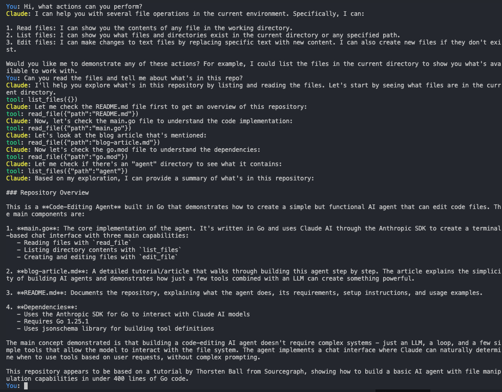

# Code-Editing Agent

This is a simple but fully functional code-editing AI agent built in Go, based on the tutorial ["How to Build an Agent"](https://ampcode.com/manual/how-to-build-an-agent) by Thorsten Ball from Sourcegraph.



## What it does

This agent demonstrates that building a code-editing AI agent isn't magic - it's just an LLM, a loop, and enough tokens. In less than 400 lines of Go code, you get:

- **Chat interface**: Talk to Claude directly in your terminal
- **File reading**: The agent can read files in your current directory
- **Directory listing**: The agent can explore your project structure
- **File editing**: The agent can create and modify files using string replacement

## Requirements

- Go 1.20+
- Anthropic API key set as environment variable `ANTHROPIC_API_KEY`

## Setup

1. Clone or download this repository
2. Set your Anthropic API key:
   ```bash
   export ANTHROPIC_API_KEY="your-api-key-here"
   ```
3. Download dependencies:
   ```bash
   go mod tidy
   ```
4. Run the agent:
   ```bash
   go run main.go
   ```

## Usage

Once running, you can chat with Claude and it will automatically use tools when needed:

```
You: what files are in this directory?
Claude: I'll help you see what's in the current directory. Let me list the files...
tool: list_files({})
Claude: I can see several files including main.go, go.mod, README.md...

You: create a hello.go file with a simple hello world program
Claude: I'll create a hello.go file with a simple hello world program for you.
tool: edit_file({"path":"hello.go","old_str":"","new_str":"package main\n\nimport \"fmt\"\n\nfunc main() {\n\tfmt.Println(\"Hello, World!\")\n}"})
Claude: I've created a hello.go file with a simple Hello World program...
```

## How it works

The agent implements three core tools:

1. **read_file**: Reads the contents of any file
2. **list_files**: Lists files and directories 
3. **edit_file**: Creates or modifies files using string replacement

The magic is in the simplicity - Claude naturally knows when to use these tools based on your requests, without complex prompting or explicit instructions.

## The Secret

There is no secret. As the original blog post explains: "It's an LLM, a loop, and enough tokens." The models are incredibly powerful now, and with just a few simple tools, you can build something that feels like magic.

## Original Article

This code is based on the excellent tutorial by Thorsten Ball: [How to Build an Agent](https://ampcode.com/manual/how-to-build-an-agent) - I highly recommend reading it to understand the concepts and see the step-by-step process.

The article demonstrates that building impressive AI agents doesn't require genius - just practical engineering and understanding of how to give LLMs the tools they need to be useful.
